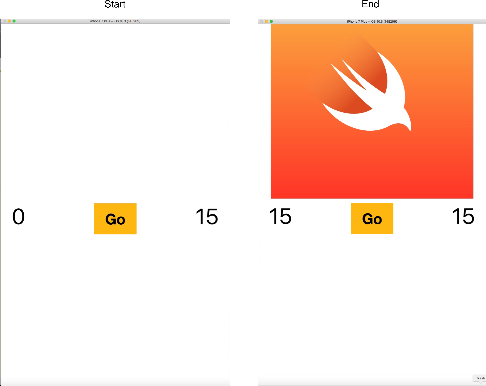
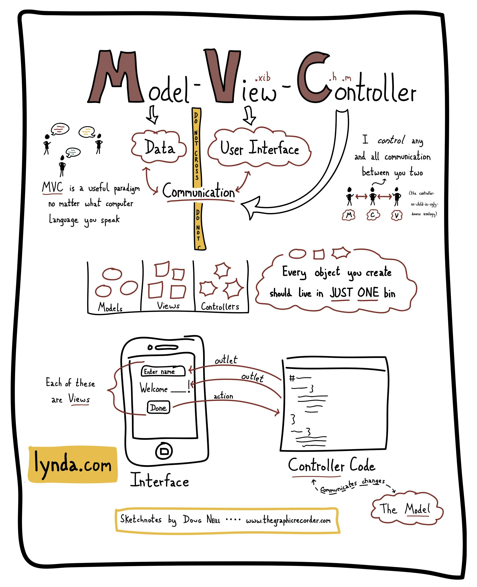

# Learning iOS Development

--- 

## An Analogy...

####Starting out

---

### This is hard...

##### You get stuck

---

### That's why we are here!

—--

## What if you already know some programming?

---

### Then its a bit easier to get started

--- 

### But even experts get stuck

---

## So we come back to....

---

## HELP EACH OTHER

---

# Our Very First App

##### What will you learn

- Xcode overview
- Beginnging Autolayout
- Outlets
- Actions
- MVC pattern
- User interaction
- Reacting to orientation

--- 

## MVC Pattern

---

